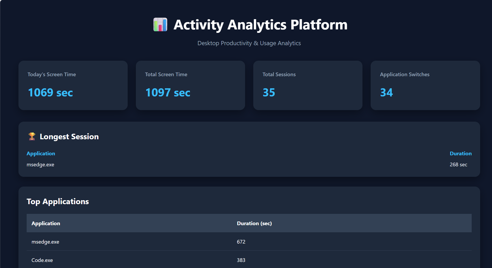
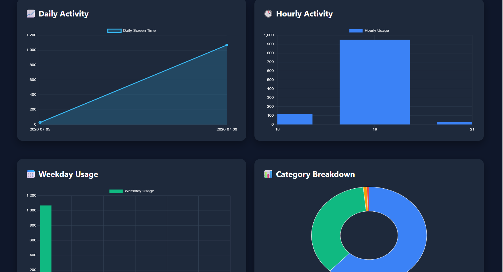

# Productivity Analytics Dashboard

## Overview

Productivity Analytics Dashboard is a desktop activity analytics application that automatically monitors active application usage, stores activity sessions in SQLite, performs usage analysis using Pandas, and visualizes productivity metrics through a Flask-based interactive dashboard.

The platform continuously tracks desktop activity in the background, categorizes applications into predefined groups, and provides interactive visualizations that help users understand their productivity patterns over time.

---

## Features

- Background desktop activity monitoring
- Tracks active desktop applications in real time
- Records application sessions with start time, end time, and duration
- Automatically categorizes applications into predefined categories
- Interactive dashboard with automatic data refresh
- Daily, weekly, and monthly usage analytics
- Hourly and weekday activity visualization
- Top application usage statistics
- Category-wise screen time analysis
- REST API for accessing analytics data
- Stores activity history using SQLite

---

## Technology Stack

### Backend

- Python
- Flask
- SQLite
- Pandas

### Frontend

- HTML
- CSS
- JavaScript
- Chart.js

---

## Project Structure

```text
productivity-analytics-dashboard/
│
├── analytics/
│   └── statistics.py
│
├── database/
│   ├── database.py
│   ├── repository.py
│   └── activity.db
│
├── tracker/
│   ├── tracker.py
│   ├── window_detector.py
│   ├── categorizer.py
│   └── application_categories.py
│
├── templates/
│   └── index.html
│
├── static/
│   ├── style.css
│   └── dashboard.js
│
├── screenshots/
│   ├── dashboard.png
│   └── insights.png
│
├── app.py
├── main.py
├── requirements.txt
├── README.md
├── LICENSE
└── .gitignore
```

---

## Dashboard Analytics

The dashboard provides comprehensive productivity insights, including:

- Today's screen time
- Total tracked screen time
- Total activity sessions
- Application switches
- Longest application session
- Top application usage
- Daily activity trends
- Hourly activity distribution
- Weekday productivity analysis
- Category-wise screen time distribution

The dashboard automatically refreshes to display the latest activity statistics.

---

## REST API

| Endpoint | Description |
|----------|-------------|
| `/api/dashboard` | Dashboard summary statistics |
| `/api/top-applications` | Top application usage |
| `/api/daily` | Daily screen time statistics |
| `/api/hourly` | Hourly activity distribution |
| `/api/weekday` | Weekday activity statistics |
| `/api/categories` | Category-wise usage |
| `/api/category-percentage` | Category percentage breakdown |

---

## Installation

Clone the repository:

```bash
git clone https://github.com/hima-12376/productivity-analytics-dashboard.git
```

Navigate to the project directory:

```bash
cd productivity-analytics-dashboard
```

Install the required dependencies:

```bash
pip install -r requirements.txt
```

Start the background activity tracker:

```bash
python main.py
```

Open a new terminal and launch the analytics dashboard:

```bash
python app.py
```

Open your browser and visit:

```
http://127.0.0.1:5000
```

---

## Screenshots

### Dashboard

The main dashboard provides a comprehensive overview of application usage, screen time statistics, productivity trends, and category-wise analytics.



---

### Productivity Insights

The insights page presents detailed analytics, including application rankings, usage trends, and category-wise statistics to help users better understand their productivity patterns.



---

## Future Improvements

- AI-generated productivity summaries
- Export analytics reports as PDF or CSV
- System tray integration
- Automatic startup on system boot
- User-defined application categories
- Productivity scoring and recommendations
- Multi-device activity synchronization
- Interactive filtering and search

---

## License

This project is licensed under the MIT License.

---

## Author

**Hima Paul**

GitHub: https://github.com/hima-12376
